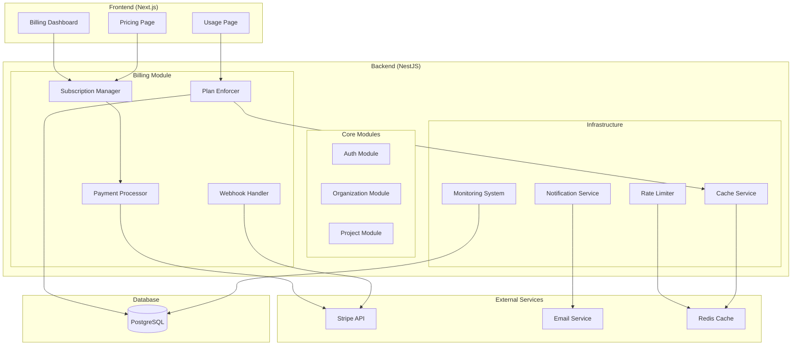
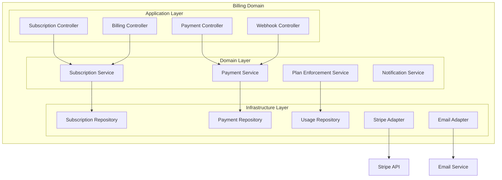

# Design Document: Production-Ready Billing System

## Overview

Este documento describe el diseño arquitectónico para implementar un sistema completo de facturación, suscripciones y monetización en la plataforma Forge. El sistema está diseñado para ser escalable, seguro y confiable, integrándose perfectamente con la arquitectura hexagonal existente de NestJS + Next.js.

El diseño incluye gestión de planes de suscripción, procesamiento de pagos con Stripe, verificación de límites en tiempo real, dashboard de facturación, sistema de notificaciones, y todas las funcionalidades necesarias para operar en producción de forma rentable.

## Architecture

### High-Level Architecture



### Billing Module Architecture



## Components and Interfaces

### 1. Subscription Management

#### Subscription Entity
```typescript
interface Subscription {
  id: string;
  organizationId: string;
  stripeCustomerId: string;
  stripeSubscriptionId: string;
  plan: SubscriptionPlan;
  status: SubscriptionStatus;
  currentPeriodStart: Date;
  currentPeriodEnd: Date;
  trialEnd?: Date;
  cancelAtPeriodEnd: boolean;
  createdAt: Date;
  updatedAt: Date;
}

enum SubscriptionPlan {
  FREE = 'FREE',
  PRO = 'PRO',
  ENTERPRISE = 'ENTERPRISE'
}

enum SubscriptionStatus {
  ACTIVE = 'active',
  PAST_DUE = 'past_due',
  CANCELED = 'canceled',
  UNPAID = 'unpaid',
  TRIALING = 'trialing'
}
```

#### Plan Configuration
```typescript
interface PlanLimits {
  maxProjects: number | null; // null = unlimited
  maxUsers: number | null;
  storageGB: number | null;
  apiRequestsPerHour: number;
  supportLevel: 'community' | 'email' | 'priority';
}

const PLAN_CONFIGS: Record<SubscriptionPlan, PlanLimits> = {
  FREE: {
    maxProjects: 3,
    maxUsers: 5,
    storageGB: 1,
    apiRequestsPerHour: 100,
    supportLevel: 'community'
  },
  PRO: {
    maxProjects: 50,
    maxUsers: 100,
    storageGB: 100,
    apiRequestsPerHour: 1000,
    supportLevel: 'email'
  },
  ENTERPRISE: {
    maxProjects: null,
    maxUsers: null,
    storageGB: 1000,
    apiRequestsPerHour: 10000,
    supportLevel: 'priority'
  }
};
```

### 2. Payment Processing

#### Payment Service Interface
```typescript
interface PaymentService {
  createSubscription(organizationId: string, planId: string, paymentMethodId: string): Promise<Subscription>;
  updateSubscription(subscriptionId: string, newPlan: SubscriptionPlan): Promise<Subscription>;
  cancelSubscription(subscriptionId: string, cancelAtPeriodEnd: boolean): Promise<Subscription>;
  createCheckoutSession(organizationId: string, planId: string): Promise<string>;
  createBillingPortalSession(customerId: string): Promise<string>;
  processWebhook(event: StripeEvent): Promise<void>;
}
```

#### Stripe Integration
```typescript
interface StripeAdapter {
  createCustomer(organizationId: string, email: string): Promise<string>;
  createSubscription(customerId: string, priceId: string): Promise<StripeSubscription>;
  updateSubscription(subscriptionId: string, priceId: string): Promise<StripeSubscription>;
  cancelSubscription(subscriptionId: string): Promise<StripeSubscription>;
  retrieveInvoices(customerId: string): Promise<StripeInvoice[]>;
  constructWebhookEvent(payload: string, signature: string): StripeEvent;
}
```

### 3. Plan Enforcement

#### Plan Enforcer Service
```typescript
interface PlanEnforcementService {
  checkSubscriptionStatus(organizationId: string): Promise<SubscriptionStatus>;
  enforceProjectLimit(organizationId: string): Promise<boolean>;
  enforceUserLimit(organizationId: string): Promise<boolean>;
  enforceStorageLimit(organizationId: string): Promise<boolean>;
  enforceRateLimit(organizationId: string): Promise<boolean>;
  getUsageMetrics(organizationId: string): Promise<UsageMetrics>;
}

interface UsageMetrics {
  projectCount: number;
  userCount: number;
  storageUsedGB: number;
  apiRequestsThisHour: number;
  limits: PlanLimits;
  percentageUsed: {
    projects: number;
    users: number;
    storage: number;
  };
}
```

#### Enforcement Middleware
```typescript
@Injectable()
export class PlanEnforcementGuard implements CanActivate {
  constructor(
    private planEnforcer: PlanEnforcementService,
    private reflector: Reflector
  ) {}

  async canActivate(context: ExecutionContext): Promise<boolean> {
    const request = context.switchToHttp().getRequest();
    const organizationId = request.user.organizationId;
    
    const requiredFeature = this.reflector.get<string>('feature', context.getHandler());
    
    if (!requiredFeature) return true;
    
    switch (requiredFeature) {
      case 'project_creation':
        return await this.planEnforcer.enforceProjectLimit(organizationId);
      case 'user_invitation':
        return await this.planEnforcer.enforceUserLimit(organizationId);
      case 'file_upload':
        return await this.planEnforcer.enforceStorageLimit(organizationId);
      default:
        return true;
    }
  }
}
```

### 4. Webhook Processing

#### Webhook Handler
```typescript
interface WebhookHandler {
  handleInvoicePaymentSucceeded(event: StripeEvent): Promise<void>;
  handleInvoicePaymentFailed(event: StripeEvent): Promise<void>;
  handleCustomerSubscriptionUpdated(event: StripeEvent): Promise<void>;
  handleCustomerSubscriptionDeleted(event: StripeEvent): Promise<void>;
}

@Injectable()
export class StripeWebhookHandler implements WebhookHandler {
  async handleInvoicePaymentSucceeded(event: StripeEvent): Promise<void> {
    const invoice = event.data.object as StripeInvoice;
    
    // Update subscription status
    await this.subscriptionService.updateStatus(
      invoice.subscription as string,
      SubscriptionStatus.ACTIVE
    );
    
    // Send confirmation email
    await this.notificationService.sendPaymentConfirmation(
      invoice.customer as string,
      invoice
    );
    
    // Log successful payment
    await this.auditService.logPaymentSuccess(invoice);
  }
}
```

### 5. Rate Limiting

#### Rate Limiting Configuration
```typescript
interface RateLimitConfig {
  ttl: number; // Time to live in seconds
  limit: number; // Max requests per TTL
  blockDuration?: number; // Block duration after limit exceeded
}

const RATE_LIMIT_CONFIGS: Record<SubscriptionPlan, RateLimitConfig> = {
  FREE: { ttl: 3600, limit: 100, blockDuration: 300 },
  PRO: { ttl: 3600, limit: 1000, blockDuration: 60 },
  ENTERPRISE: { ttl: 3600, limit: 10000, blockDuration: 30 }
};

@Injectable()
export class SubscriptionBasedThrottlerGuard extends ThrottlerGuard {
  protected async getTracker(req: Record<string, any>): Promise<string> {
    return req.user?.organizationId || req.ip;
  }

  protected async getLimit(context: ExecutionContext): Promise<number> {
    const request = context.switchToHttp().getRequest();
    const organizationId = request.user?.organizationId;
    
    if (!organizationId) return 10; // Anonymous users
    
    const subscription = await this.subscriptionService.findByOrganization(organizationId);
    const config = RATE_LIMIT_CONFIGS[subscription?.plan || SubscriptionPlan.FREE];
    
    return config.limit;
  }
}
```

## Data Models

### Database Schema

```sql
-- Subscriptions table
CREATE TABLE subscriptions (
  id UUID PRIMARY KEY DEFAULT gen_random_uuid(),
  organization_id UUID NOT NULL REFERENCES organizations(id),
  stripe_customer_id VARCHAR(255) NOT NULL,
  stripe_subscription_id VARCHAR(255),
  plan subscription_plan NOT NULL DEFAULT 'FREE',
  status subscription_status NOT NULL DEFAULT 'active',
  current_period_start TIMESTAMP WITH TIME ZONE,
  current_period_end TIMESTAMP WITH TIME ZONE,
  trial_end TIMESTAMP WITH TIME ZONE,
  cancel_at_period_end BOOLEAN DEFAULT FALSE,
  created_at TIMESTAMP WITH TIME ZONE DEFAULT NOW(),
  updated_at TIMESTAMP WITH TIME ZONE DEFAULT NOW(),
  
  UNIQUE(organization_id),
  UNIQUE(stripe_customer_id),
  UNIQUE(stripe_subscription_id)
);

-- Payment history table
CREATE TABLE payments (
  id UUID PRIMARY KEY DEFAULT gen_random_uuid(),
  subscription_id UUID NOT NULL REFERENCES subscriptions(id),
  stripe_invoice_id VARCHAR(255) NOT NULL,
  amount_cents INTEGER NOT NULL,
  currency VARCHAR(3) NOT NULL DEFAULT 'USD',
  status payment_status NOT NULL,
  paid_at TIMESTAMP WITH TIME ZONE,
  created_at TIMESTAMP WITH TIME ZONE DEFAULT NOW(),
  
  UNIQUE(stripe_invoice_id)
);

-- Usage tracking table
CREATE TABLE usage_metrics (
  id UUID PRIMARY KEY DEFAULT gen_random_uuid(),
  organization_id UUID NOT NULL REFERENCES organizations(id),
  metric_type usage_metric_type NOT NULL,
  value INTEGER NOT NULL,
  recorded_at TIMESTAMP WITH TIME ZONE DEFAULT NOW(),
  
  INDEX(organization_id, metric_type, recorded_at)
);

-- Audit log table
CREATE TABLE billing_audit_log (
  id UUID PRIMARY KEY DEFAULT gen_random_uuid(),
  organization_id UUID NOT NULL REFERENCES organizations(id),
  event_type VARCHAR(100) NOT NULL,
  event_data JSONB NOT NULL,
  created_at TIMESTAMP WITH TIME ZONE DEFAULT NOW(),
  
  INDEX(organization_id, event_type, created_at)
);

-- Enums
CREATE TYPE subscription_plan AS ENUM ('FREE', 'PRO', 'ENTERPRISE');
CREATE TYPE subscription_status AS ENUM ('active', 'past_due', 'canceled', 'unpaid', 'trialing');
CREATE TYPE payment_status AS ENUM ('succeeded', 'failed', 'pending', 'refunded');
CREATE TYPE usage_metric_type AS ENUM ('projects', 'users', 'storage_gb', 'api_requests');
```

### Prisma Schema Extensions

```prisma
model Subscription {
  id                   String            @id @default(cuid())
  organizationId       String            @unique @map("organization_id")
  stripeCustomerId     String            @unique @map("stripe_customer_id")
  stripeSubscriptionId String?           @unique @map("stripe_subscription_id")
  plan                 SubscriptionPlan  @default(FREE)
  status               SubscriptionStatus @default(active)
  currentPeriodStart   DateTime?         @map("current_period_start")
  currentPeriodEnd     DateTime?         @map("current_period_end")
  trialEnd             DateTime?         @map("trial_end")
  cancelAtPeriodEnd    Boolean           @default(false) @map("cancel_at_period_end")
  createdAt            DateTime          @default(now()) @map("created_at")
  updatedAt            DateTime          @updatedAt @map("updated_at")

  organization Organization @relation(fields: [organizationId], references: [id])
  payments     Payment[]
  
  @@map("subscriptions")
}

model Payment {
  id              String        @id @default(cuid())
  subscriptionId  String        @map("subscription_id")
  stripeInvoiceId String        @unique @map("stripe_invoice_id")
  amountCents     Int           @map("amount_cents")
  currency        String        @default("USD")
  status          PaymentStatus
  paidAt          DateTime?     @map("paid_at")
  createdAt       DateTime      @default(now()) @map("created_at")

  subscription Subscription @relation(fields: [subscriptionId], references: [id])
  
  @@map("payments")
}

model UsageMetric {
  id             String           @id @default(cuid())
  organizationId String           @map("organization_id")
  metricType     UsageMetricType  @map("metric_type")
  value          Int
  recordedAt     DateTime         @default(now()) @map("recorded_at")

  organization Organization @relation(fields: [organizationId], references: [id])
  
  @@map("usage_metrics")
  @@index([organizationId, metricType, recordedAt])
}

enum SubscriptionPlan {
  FREE
  PRO
  ENTERPRISE
}

enum SubscriptionStatus {
  active
  past_due
  canceled
  unpaid
  trialing
}

enum PaymentStatus {
  succeeded
  failed
  pending
  refunded
}

enum UsageMetricType {
  projects
  users
  storage_gb
  api_requests
}
```
Ahora procederé con el análisis de prework para las propiedades de corrección antes de completar la sección de Correctness Properties:

<function_calls>
<invoke name="prework">
<parameter name="featureName">production-ready-billing-system

## Correctness Properties

*Una propiedad es una característica o comportamiento que debe mantenerse verdadero en todas las ejecuciones válidas de un sistema—esencialmente, una declaración formal sobre lo que el sistema debe hacer. Las propiedades sirven como puente entre las especificaciones legibles por humanos y las garantías de corrección verificables por máquina.*

Basándome en el análisis de prework de los criterios de aceptación, he identificado las siguientes propiedades de corrección que deben ser validadas mediante property-based testing:

### Property 1: Subscription Creation Consistency
*Para cualquier* organización y plan de suscripción válidos, cuando se crea una suscripción, el Subscription_Manager debe crear una suscripción activa con los límites exactos correspondientes al plan seleccionado.
**Validates: Requirements 1.2**

### Property 2: Plan Upgrade Immediate Effect
*Para cualquier* organización con suscripción activa, cuando se actualiza a un plan superior, los nuevos límites deben aplicarse inmediatamente y la facturación debe prorratearse correctamente.
**Validates: Requirements 1.3**

### Property 3: Plan Downgrade Scheduling
*Para cualquier* organización con suscripción activa, cuando se degrada a un plan inferior, el cambio debe programarse para el próximo ciclo de facturación sin afectar los límites actuales.
**Validates: Requirements 1.4**

### Property 4: Trial Period Enforcement
*Para cualquier* suscripción de prueba, debe proporcionar acceso completo a funcionalidades PRO por exactamente 14 días desde la creación.
**Validates: Requirements 1.5**

### Property 5: Payment Processing Consistency
*Para cualquier* pago debido, el Payment_Processor debe procesar el cargo a través de Stripe y actualizar el estado de suscripción correctamente según el resultado del pago.
**Validates: Requirements 2.1, 2.2**

### Property 6: Payment Failure Handling
*Para cualquier* pago fallido, el sistema debe implementar la lógica de reintentos de Stripe y notificar al cliente inmediatamente.
**Validates: Requirements 2.3**

### Property 7: Webhook Event Processing
*Para cualquier* evento webhook válido de Stripe, el Webhook_Handler debe procesarlo correctamente y mantener la consistencia de datos sin duplicación.
**Validates: Requirements 2.4**

### Property 8: Invoice Generation Completeness
*Para cualquier* pago exitoso, el sistema debe generar y almacenar una factura completa con todos los detalles requeridos.
**Validates: Requirements 2.5**

### Property 9: Subscription Status Verification
*Para cualquier* acción de usuario, el Plan_Enforcer debe verificar que la organización tenga una suscripción activa antes de permitir la acción.
**Validates: Requirements 3.1**

### Property 10: Plan Limits Enforcement
*Para cualquier* organización y tipo de límite (proyectos, usuarios, almacenamiento), el Plan_Enforcer debe prevenir acciones que excedan los límites del plan actual y mostrar mensajes apropiados.
**Validates: Requirements 3.2, 3.3, 3.4, 3.5, 3.6**

### Property 11: Dashboard Information Completeness
*Para cualquier* suscripción activa, el Billing_Dashboard debe mostrar toda la información requerida: estado actual, detalles del plan, próxima fecha de facturación, y uso actual contra límites.
**Validates: Requirements 4.1, 4.5**

### Property 12: Payment History Display
*Para cualquier* organización con historial de pagos, el dashboard debe mostrar todos los pagos con facturas descargables correctamente formateadas.
**Validates: Requirements 4.3**

### Property 13: Payment Event Notifications
*Para cualquier* evento de pago (exitoso o fallido), el Notification_Service debe enviar las notificaciones apropiadas por email e in-app inmediatamente.
**Validates: Requirements 5.1, 5.2, 5.6**

### Property 14: Renewal Reminder Timing
*Para cualquier* suscripción que se acerque a renovación, el sistema debe enviar recordatorios exactamente 7 días antes de la fecha de renovación.
**Validates: Requirements 5.3**

### Property 15: Usage Limit Notifications
*Para cualquier* organización cuyo uso alcance el 80% o exceda los límites del plan, el Notification_Service debe enviar las notificaciones de advertencia o actualización apropiadas.
**Validates: Requirements 5.4, 5.5**

### Property 16: Rate Limiting by Plan
*Para cualquier* organización, el Rate_Limiter debe aplicar límites de API requests basados en su plan de suscripción actual y bloquear requests que excedan el límite.
**Validates: Requirements 6.1**

### Property 17: Comprehensive Event Logging
*Para cualquier* evento de facturación, transacción de pago, o error del sistema, el Monitoring_System debe crear logs completos con toda la información necesaria para auditoría.
**Validates: Requirements 6.2, 7.4**

### Property 18: System Issue Alerting
*Para cualquier* problema crítico del sistema, el Monitoring_System debe enviar alertas a los administradores dentro de 5 minutos.
**Validates: Requirements 6.6, 8.6**

### Property 19: Billing Data Security
*Para cualquier* dato sensible de facturación, el sistema debe aplicar encriptación apropiada y nunca almacenar información de tarjetas de crédito directamente, usando tokenización de Stripe.
**Validates: Requirements 7.1, 7.2**

### Property 20: Webhook Signature Validation
*Para cualquier* webhook entrante, el Webhook_Handler debe verificar la firma de Stripe antes de procesar el evento, rechazando webhooks con firmas inválidas.
**Validates: Requirements 7.3**

### Property 21: Access Control Enforcement
*Para cualquier* función administrativa de facturación, el sistema debe verificar que el usuario tenga los permisos apropiados antes de permitir el acceso.
**Validates: Requirements 7.5**

### Property 22: External Service Retry Logic
*Para cualquier* falla de servicio externo (Stripe API, webhook processing), el sistema debe implementar retry logic con backoff exponencial hasta los límites configurados.
**Validates: Requirements 8.1, 8.2**

### Property 23: Transaction Rollback Consistency
*Para cualquier* falla de operación de base de datos durante transacciones de facturación, el sistema debe hacer rollback completo y mantener consistencia de datos.
**Validates: Requirements 8.3**

### Property 24: Graceful Service Degradation
*Para cualquier* servicio no crítico que esté indisponible, el sistema debe continuar funcionando con funcionalidad reducida sin afectar operaciones críticas.
**Validates: Requirements 8.4**

### Property 25: Subscription Verification Fallback
*Para cualquier* falla en verificación de suscripción, el Plan_Enforcer debe permitir acceso de solo lectura por exactamente 24 horas.
**Validates: Requirements 8.5**

## Error Handling

### Error Categories

1. **Payment Errors**
   - Card declined, insufficient funds, expired cards
   - Network timeouts with Stripe API
   - Invalid payment method tokens

2. **Subscription Errors**
   - Plan limits exceeded
   - Invalid plan transitions
   - Subscription status conflicts

3. **Webhook Errors**
   - Invalid signatures
   - Duplicate events
   - Processing failures

4. **System Errors**
   - Database connection failures
   - External service unavailability
   - Rate limit exceeded

### Error Handling Strategies

#### Payment Error Handling
```typescript
interface PaymentErrorHandler {
  handleCardDeclined(error: StripeError): Promise<PaymentResult>;
  handleInsufficientFunds(error: StripeError): Promise<PaymentResult>;
  handleNetworkTimeout(error: StripeError): Promise<PaymentResult>;
}

@Injectable()
export class PaymentErrorHandlerImpl implements PaymentErrorHandler {
  async handleCardDeclined(error: StripeError): Promise<PaymentResult> {
    // Log the error
    await this.auditService.logPaymentError(error);
    
    // Notify customer immediately
    await this.notificationService.sendPaymentFailedNotification(
      error.payment_intent.customer,
      'card_declined'
    );
    
    // Update subscription status
    await this.subscriptionService.updateStatus(
      error.payment_intent.metadata.subscription_id,
      SubscriptionStatus.PAST_DUE
    );
    
    return {
      success: false,
      error: 'payment_failed',
      retryable: true,
      nextRetryAt: this.calculateNextRetry(error)
    };
  }
}
```

#### Webhook Error Handling
```typescript
@Injectable()
export class WebhookErrorHandler {
  private readonly maxRetries = 5;
  private readonly baseDelay = 1000; // 1 second

  async handleWebhookError(
    event: StripeEvent,
    error: Error,
    attemptNumber: number
  ): Promise<void> {
    await this.auditService.logWebhookError(event, error, attemptNumber);

    if (attemptNumber >= this.maxRetries) {
      await this.alertService.sendCriticalAlert(
        'Webhook processing failed after max retries',
        { eventId: event.id, error: error.message }
      );
      return;
    }

    const delay = this.baseDelay * Math.pow(2, attemptNumber);
    await this.scheduleRetry(event, delay);
  }

  private async scheduleRetry(event: StripeEvent, delay: number): Promise<void> {
    await this.queueService.schedule(
      'webhook-retry',
      { event },
      { delay }
    );
  }
}
```

#### Circuit Breaker Pattern
```typescript
@Injectable()
export class StripeCircuitBreaker {
  private failureCount = 0;
  private lastFailureTime: Date | null = null;
  private state: 'CLOSED' | 'OPEN' | 'HALF_OPEN' = 'CLOSED';
  
  private readonly failureThreshold = 5;
  private readonly recoveryTimeout = 60000; // 1 minute

  async execute<T>(operation: () => Promise<T>): Promise<T> {
    if (this.state === 'OPEN') {
      if (this.shouldAttemptReset()) {
        this.state = 'HALF_OPEN';
      } else {
        throw new Error('Circuit breaker is OPEN');
      }
    }

    try {
      const result = await operation();
      this.onSuccess();
      return result;
    } catch (error) {
      this.onFailure();
      throw error;
    }
  }

  private onSuccess(): void {
    this.failureCount = 0;
    this.state = 'CLOSED';
  }

  private onFailure(): void {
    this.failureCount++;
    this.lastFailureTime = new Date();
    
    if (this.failureCount >= this.failureThreshold) {
      this.state = 'OPEN';
    }
  }
}
```

## Testing Strategy

### Dual Testing Approach

El sistema implementará un enfoque dual de testing que combina unit tests y property-based tests para garantizar cobertura comprehensiva:

#### Unit Testing
- **Propósito**: Validar ejemplos específicos, casos edge, y condiciones de error
- **Enfoque**: Casos concretos con datos conocidos
- **Herramientas**: Jest para NestJS, React Testing Library para Next.js
- **Cobertura**: 
  - Casos específicos de integración Stripe
  - Validación de datos de entrada
  - Manejo de errores específicos
  - Componentes de UI del dashboard

#### Property-Based Testing
- **Propósito**: Validar propiedades universales a través de todos los inputs posibles
- **Enfoque**: Generación automática de casos de prueba
- **Herramientas**: fast-check para JavaScript/TypeScript
- **Configuración**: Mínimo 100 iteraciones por test de propiedad
- **Cobertura**: Todas las 25 propiedades de corrección identificadas

### Property-Based Testing Configuration

```typescript
// Configuración base para property tests
const PROPERTY_TEST_CONFIG = {
  numRuns: 100,
  timeout: 10000,
  seed: Math.random(),
  verbose: true
};

// Ejemplo de property test
describe('Billing System Properties', () => {
  it('Property 1: Subscription Creation Consistency', async () => {
    await fc.assert(
      fc.asyncProperty(
        fc.record({
          organizationId: fc.uuid(),
          plan: fc.constantFrom('FREE', 'PRO', 'ENTERPRISE'),
          email: fc.emailAddress()
        }),
        async ({ organizationId, plan, email }) => {
          // Feature: production-ready-billing-system, Property 1: Subscription Creation Consistency
          const subscription = await subscriptionService.createSubscription(
            organizationId,
            plan,
            email
          );
          
          expect(subscription.organizationId).toBe(organizationId);
          expect(subscription.plan).toBe(plan);
          expect(subscription.status).toBe(SubscriptionStatus.ACTIVE);
          
          const limits = await planEnforcer.getLimits(organizationId);
          expect(limits).toEqual(PLAN_CONFIGS[plan]);
        }
      ),
      PROPERTY_TEST_CONFIG
    );
  });
});
```

### Test Data Generation

```typescript
// Generadores para property-based testing
const Generators = {
  organization: () => fc.record({
    id: fc.uuid(),
    name: fc.string({ minLength: 1, maxLength: 100 }),
    email: fc.emailAddress()
  }),
  
  subscription: () => fc.record({
    id: fc.uuid(),
    organizationId: fc.uuid(),
    plan: fc.constantFrom('FREE', 'PRO', 'ENTERPRISE'),
    status: fc.constantFrom('active', 'past_due', 'canceled', 'unpaid', 'trialing'),
    currentPeriodStart: fc.date(),
    currentPeriodEnd: fc.date()
  }),
  
  stripeEvent: () => fc.record({
    id: fc.string({ minLength: 1 }),
    type: fc.constantFrom(
      'invoice.payment_succeeded',
      'invoice.payment_failed',
      'customer.subscription.updated',
      'customer.subscription.deleted'
    ),
    data: fc.object()
  })
};
```

### Integration Testing

```typescript
describe('Billing System Integration', () => {
  beforeEach(async () => {
    await testDb.clean();
    await stripeTestHelper.reset();
  });

  it('should handle complete subscription lifecycle', async () => {
    // Create organization
    const org = await organizationService.create({
      name: 'Test Org',
      email: 'test@example.com'
    });

    // Subscribe to PRO plan
    const subscription = await subscriptionService.createSubscription(
      org.id,
      'PRO',
      'pm_card_visa'
    );

    // Verify limits are applied
    const limits = await planEnforcer.getLimits(org.id);
    expect(limits.maxProjects).toBe(50);

    // Simulate successful payment webhook
    await webhookHandler.handleInvoicePaymentSucceeded({
      type: 'invoice.payment_succeeded',
      data: { object: { subscription: subscription.stripeSubscriptionId } }
    });

    // Verify subscription is active
    const updatedSubscription = await subscriptionService.findById(subscription.id);
    expect(updatedSubscription.status).toBe(SubscriptionStatus.ACTIVE);
  });
});
```

### Performance Testing

```typescript
describe('Billing System Performance', () => {
  it('should handle plan enforcement under load', async () => {
    const organizationId = 'test-org-id';
    const concurrentRequests = 100;
    
    const promises = Array.from({ length: concurrentRequests }, () =>
      planEnforcer.enforceProjectLimit(organizationId)
    );
    
    const startTime = Date.now();
    const results = await Promise.all(promises);
    const endTime = Date.now();
    
    expect(endTime - startTime).toBeLessThan(1000); // Should complete within 1 second
    expect(results.every(result => typeof result === 'boolean')).toBe(true);
  });
});
```

Cada property test debe incluir un comentario con el formato:
**Feature: production-ready-billing-system, Property {number}: {property_text}**

Esta estrategia de testing asegura que el sistema de facturación sea robusto, confiable y esté listo para producción con cobertura comprehensiva tanto de casos específicos como de propiedades universales.