# Forge – Logical Flow Diagram

Este documento describe el flujo lógico principal de la aplicación Forge.
El objetivo es dejar explícito el comportamiento del sistema a nivel funcional,
independientemente de la implementación técnica.

Este flujo sirve como referencia para:
- Backend (casos de uso)
- Frontend (UX y navegación)
- Seguridad y autenticación
- Multi-tenancy

---

## 🧠 Flujo lógico general

El sistema está centrado en organizaciones (multi-tenant) y control de acceso
basado en roles. Todo el acceso parte de la autenticación.

```mermaid
flowchart TD
    A[Usuario accede a la aplicación] --> B{Sesión válida?}

    B -- No --> C[Login / Register]
    C --> D[Validar input con Zod]
    D --> E{Credenciales válidas?}

    E -- No --> F[Mostrar error]
    E -- Sí --> G[Generar Access Token]
    G --> H[Generar Refresh Token]
    H --> I[Guardar sesión]
    I --> J[Dashboard]

    B -- Sí --> J[Dashboard]

    J --> K{Tiene organización activa?}
    K -- No --> L[Crear organización]
    L --> M[Asignar rol OWNER]
    M --> N[Listar proyectos]

    K -- Sí --> N[Listar proyectos]

    N --> O[Seleccionar proyecto]
    O --> P[Listar tareas]

    P --> Q{Acción del usuario}
    Q --> R[Crear / Editar tarea]
    Q --> S[Cambiar estado de tarea]

    R --> T[Validar reglas de negocio]
    S --> T

    T --> U[Persistir cambios]
    U --> V[Registrar auditoría]
    V --> P
```



```mermaid

[ Usuario ]
     |
     v
[ Accede a la Web ]
     |
     v
¿Tiene sesión válida?
 ├── NO ──> [ Login / Register ]
 │             |
 │             v
 │       Validar input (Zod)
 │             |
 │             v
 │       Autenticación OK?
 │        ├── NO -> Error
 │        └── SI
 │             |
 │             v
 │     Generar tokens (Access + Refresh)
 │             |
 │             v
 └────────> [ Dashboard ]
                   |
                   v
         ¿Tiene organización?
           ├── NO -> Crear Organización
           └── SI
                   |
                   v
           Listar Proyectos
                   |
                   v
         Seleccionar Proyecto
                   |
                   v
              Ver Tareas
                   |
                   v
         Crear / Editar / Completar Tareas
                   |
                   v
          Guardar cambios (API)
                   |
                   v
             Auditoría (log)

```